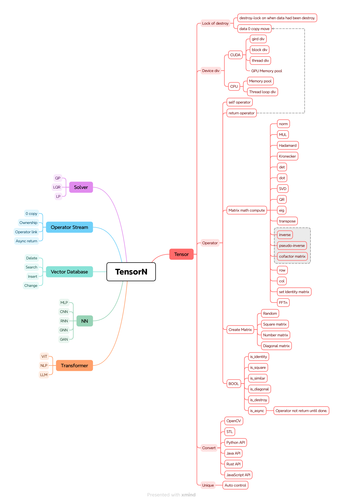
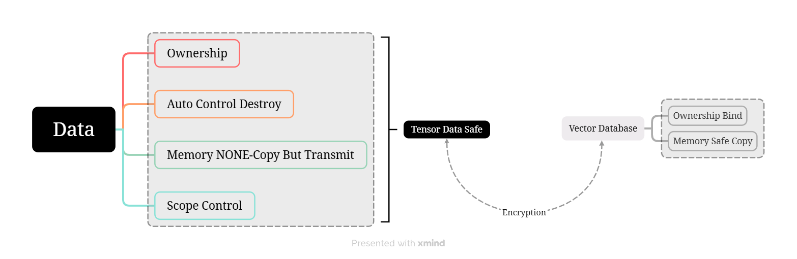
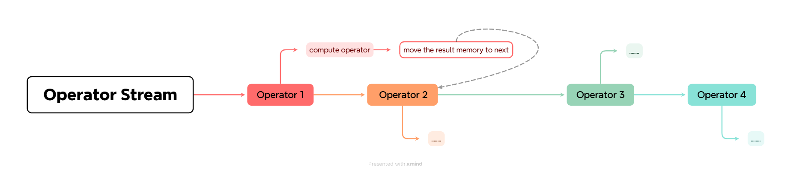

# TensorN——更安全，高效，通用的原生C++ Tensor扩展库

## 1、核心功能列表

## 2、全新设计的后端设备控制

相比于内嵌各种设备拷贝函数，直接将构造函数和各种算子独立出来似乎是更好的选择。因为无论何种方法都需要算子支持流式编程模型，与其保留主机内存，不如直接将对象和设备绑定，然后提供彼此之间的转换函数

## 3、支持与最流行的编程语言绑定

- [ ] C：原生实现
- [ ] C++：面向对象绑定
  - [ ] 支持STL⇄TensorN，同时TensorN提供线性的数据读取（begin()、end()、size()）方便转化为STL的数据
  - [ ] 支持OpenCV⇄TensorN，可以实例化为对应的Mat_<typename>
- [ ] Python：标准IO转化为Pytorch的Tensor
- [ ] Java：标准IO转化为数组
- [ ] JavaScript：标准IO转化为数组

## 4、绝对安全的所有权访问以及现代化的100%零拷贝+智能指针

- 一个所有权对应一个密码子，有另外专门的矩阵保存，基于SHA-1024以及RSA非对称加密
- 从向量数据库读取的加密数据在拷贝完成后会进行所有权鉴权
- 加密可自定，但是要提供对应的加解密API

## 5、算子流处理，运算中的0拷贝操作

## 6、提供线性求解器以及主流神经网络框架的支持

